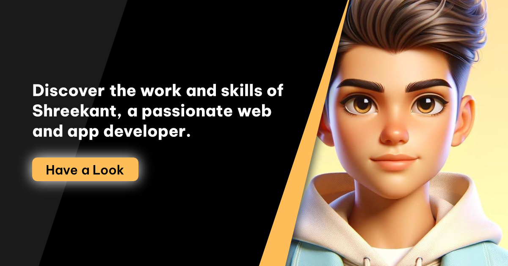

# Portfolio

A modern, production-ready personal portfolio built with React Router, Vite, TypeScript, and a Node.js/Express backend. Showcases projects, skills, certifications, and contact information, with an admin panel for content management.



---

## Features

- ⚡️ Fast, optimized, and SEO-friendly
- 🛠️ Built with React Router, TypeScript, and Vite
- 🎨 Tailwind CSS for rapid UI development
- 📱 Responsive and mobile-friendly
- 🏆 Dynamic skills and certifications (fetched from backend)
- 🗂️ Project showcase with images and categories
- 📬 Contact page with email integration
- 🧩 Modular component structure
- 🐳 Docker-ready for deployment
- 🕸️ PWA support (manifest, favicons, offline-ready)
- 📈 Analytics and performance insights (Vercel Analytics, Speed Insights)
- 🔒 Admin panel for managing portfolio content

---

## Tech Stack

- **Frontend:** React, React Router, Vite, TypeScript, Tailwind CSS
- **Backend:** Node.js, Express, MongoDB, Mongoose
- **Admin:** React + Vite (separate app)
- **Other:** Docker, PWA, SEO meta tags, Open Graph, Email (Nodemailer), Analytics

---

## Monorepo Structure

```
portfolio/
│
├── admin/         # Admin panel (React + Vite)
├── frontend/      # Main portfolio frontend (React, Vite, TypeScript)
├── server/        # Backend API (Node.js, Express, MongoDB)
└── README.md      # Project documentation
```

### Frontend

- `app/components/` – React components (Navbar, Sidebar, Home, Projects, Skills, Contact, etc.)
- `app/routes/` – Route files for each page
- `app/assets/` – Images and icons
- `public/` – Favicons, manifest, robots.txt, sitemap, Open Graph images

### Backend

- `controllers/` – API controllers (projects, certificates, contact, etc.)
- `models/` – Mongoose schemas (Project, Certificate)
- `routes/` – Express routes (public, admin, auth)
- `utils/` – Utilities (email, error handling, logger)
- `views/` – Email templates (Pug)
- `public/` – Static files

### Admin

- React + Vite app for managing portfolio content (projects, skills, certificates, etc.)

---

## Getting Started

### Prerequisites

- Node.js (v18+ recommended)
- npm or yarn
- MongoDB

### Installation

Clone the repository and install dependencies for each package:

```bash
# Clone the repository
git clone https://github.com/Shreekant-04/portfolio.git
cd portfolio

# Install frontend
cd frontend
npm install

# Install backend
cd ../server
npm install

# Install admin panel
cd ../admin
npm install
```

### Development

#### Frontend

```bash
cd frontend
npm run dev
```

Visit [http://localhost:5173](http://localhost:5173)

#### Backend

```bash
cd server
npm start
```

API runs on [http://localhost:2204](http://localhost:2204) by default.

#### Admin

```bash
cd admin
npm run dev
```

Visit [http://localhost:5174](http://localhost:5174) (or as configured).

### Building for Production

```bash
# Frontend
cd frontend
npm run build

# Backend
cd ../server
npm run build # (if applicable)
```

### Deployment

#### Docker

Build and run with Docker:

```bash
docker build -t portfolio-app .
docker run -p 3000:3000 portfolio-app
```

#### Other Platforms

You can deploy the build output to any static hosting or Node.js server, including Vercel, Netlify, AWS, Azure, DigitalOcean, and more.

---

## API Endpoints

- `GET /api/v1/public/projects` – List all projects
- `GET /api/v1/public/certificate` – List all certificates
- `POST /api/v1/public/contact` – Send a contact message (email integration)

---

## PWA & SEO

- Includes `manifest.json`, favicons, `robots.txt`, and `sitemap.xml` for SEO and PWA support.
- Meta tags for Open Graph and Twitter Cards are set up for all main pages.

---

## Folder Structure

```
portfolio
├─ admin
│  ├─ eslint.config.js
│  ├─ index.html
│  ├─ package.json
│  ├─ public
│  │  └─ vite.svg
│  ├─ README.md
│  ├─ src
│  │  ├─ App.css
│  │  ├─ App.jsx
│  │  ├─ assets
│  │  │  └─ react.svg
│  │  ├─ index.css
│  │  └─ main.jsx
│  └─ vite.config.js
├─ frontend
│  ├─ .dockerignore
│  ├─ .react-router
│  │  └─ types
│  │     ├─ +future.ts
│  │     ├─ +routes.ts
│  │     ├─ +server-build.d.ts
│  │     └─ app
│  │        ├─ +types
│  │        │  └─ root.ts
│  │        └─ routes
│  │           └─ +types
│  │              ├─ contact.ts
│  │              ├─ home.ts
│  │              ├─ projects.ts
│  │              ├─ search.ts
│  │              └─ skills.ts
│  ├─ app
│  │  ├─ app.css
│  │  ├─ assets
│  │  │  ├─ images
│  │  │  │  ├─ avatar-1.png
│  │  │  │  ├─ avatar-2.png
│  │  │  │  ├─ avatar-3.png
│  │  │  │  ├─ avatar-4.png
│  │  │  │  ├─ blog-1.jpg
│  │  │  │  ├─ blog-2.jpg
│  │  │  │  ├─ blog-3.jpg
│  │  │  │  ├─ blog-4.jpg
│  │  │  │  ├─ blog-5.jpg
│  │  │  │  ├─ blog-6.jpg
│  │  │  │  ├─ icon-app.svg
│  │  │  │  ├─ icon-design.svg
│  │  │  │  ├─ icon-dev.svg
│  │  │  │  ├─ icon-photo.svg
│  │  │  │  ├─ icon-quote.svg
│  │  │  │  ├─ logo-1-color.png
│  │  │  │  ├─ logo-2-color.png
│  │  │  │  ├─ logo-3-color.png
│  │  │  │  ├─ logo-4-color.png
│  │  │  │  ├─ logo-5-color.png
│  │  │  │  ├─ logo-6-color.png
│  │  │  │  ├─ logo.ico
│  │  │  │  ├─ logo.svg
│  │  │  │  ├─ my-avatar.png
│  │  │  │  ├─ project-1.jpg
│  │  │  │  ├─ project-2.png
│  │  │  │  ├─ project-3.jpg
│  │  │  │  ├─ project-4.png
│  │  │  │  ├─ project-5.png
│  │  │  │  ├─ project-6.png
│  │  │  │  ├─ project-7.png
│  │  │  │  ├─ project-8.jpg
│  │  │  │  └─ project-9.png
│  │  │  └─ uifaces-cartoon-image.jpg
│  │  ├─ components
│  │  │  ├─ Common
│  │  │  │  ├─ Loader.css
│  │  │  │  ├─ Loader.tsx
│  │  │  │  └─ PageNotFOund.jsx
│  │  │  ├─ contact
│  │  │  │  └─ Contact.tsx
│  │  │  ├─ home
│  │  │  │  └─ Home.tsx
│  │  │  ├─ Navbar.tsx
│  │  │  ├─ projects
│  │  │  │  ├─ Projects.tsx
│  │  │  │  └─ Untitled-1.css
│  │  │  ├─ Resuable
│  │  │  │  └─ Reusable.jsx
│  │  │  ├─ search
│  │  │  │  └─ Search.tsx
│  │  │  ├─ Sidebar.tsx
│  │  │  └─ skills
│  │  │     └─ Skills.tsx
│  │  ├─ root.tsx
│  │  ├─ routes
│  │  │  ├─ contact.tsx
│  │  │  ├─ home.tsx
│  │  │  ├─ projects.tsx
│  │  │  ├─ search.tsx
│  │  │  └─ skills.tsx
│  │  ├─ routes.ts
│  │  └─ utils
│  │     ├─ gtag.ts
│  │     └─ schema.ts
│  ├─ Dockerfile
│  ├─ package-lock.json
│  ├─ package.json
│  ├─ public
│  │  ├─ favicon.ico
│  │  ├─ favicon128x128.ico
│  │  ├─ favicon16x16.ico
│  │  ├─ favicon192x192.ico
│  │  ├─ favicon256x256.ico
│  │  ├─ favicon32x32.ico
│  │  ├─ favicon48x48.ico
│  │  ├─ favicon512x512.ico
│  │  ├─ favicon64x64.ico
│  │  ├─ manifest.json
│  │  ├─ not-found.jpg
│  │  ├─ og-image-contact.png
│  │  ├─ og-image-home.png
│  │  ├─ og-image-projects.png
│  │  ├─ og-image-skills.png
│  │  ├─ profile.jpg
│  │  ├─ robots.txt
│  │  └─ sitemap.xml
│  ├─ react-router.config.ts
│  ├─ README.md
│  ├─ tsconfig.json
│  └─ vite.config.ts
├─ LICENSE
├─ README.md
└─ server
   ├─ app.js
   ├─ config
   │  ├─ database.js
   │  ├─ gridFs.js
   │  └─ multerConfig.js
   ├─ controllers
   │  ├─ adminController.js
   │  ├─ authController.js
   │  ├─ errorController.js
   │  └─ publicController.js
   ├─ ecosystem.config.js
   ├─ index.js
   ├─ models
   │  ├─ certificate.js
   │  └─ projectSchema.js
   ├─ nodemon.json
   ├─ package-lock.json
   ├─ package.json
   ├─ public
   │  ├─ favicon.ico
   │  └─ robots.txt
   ├─ routes
   │  ├─ adminRoutes.js
   │  ├─ authRoutes.js
   │  ├─ certificateRoute.js
   │  ├─ Project.js
   │  └─ publicRoutes.js
   ├─ utils
   │  ├─ appError.js
   │  ├─ catchAsync.js
   │  ├─ email.js
   │  └─ logger.js
   ├─ vercel.json
   └─ views
      └─ mail
         ├─ auto_reply.pug
         ├─ message.pug
         └─ otp.pug

```

---

## License

[MIT](/LICENSE)

---

[Linkedin](https://www.linkedin.com/in/shreekantkumar/)
